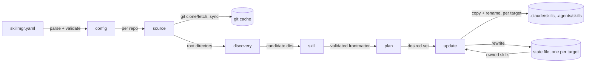

# Architecture

## Overview

`skillmgr` is a one-shot CLI. A run reads `skillmgr.yaml`, makes every source
it declares available on the local filesystem, works out which skill
directories those sources select, and then makes each target directory match
that set — installing, replacing and removing as needed. The sources are
fetched and validated once and applied to every target, so deploying to two
directories costs one fetch. Nothing runs in the background, and nothing is
left behind between runs except a git cache and one state file per target.

## Components

Each maps to a module under [src/](src/).

- **[config](src/config.rs)** — owns the schema of `skillmgr.yaml` and every
  rule about it: a git source is pinned to a revision, `local` is not, a
  `path` never climbs out of its source, an `exclude` compiles as a regular
  expression. It resolves the target directories from the CLI overrides, the
  config, then the default pair, dropping duplicates. It knows nothing about
  git or the filesystem beyond reading its own file.
- **[source](src/source.rs)** — turns one `repos:` entry into a directory on
  disk, behind the `Materializer` trait. `local` resolves to the config
  file's own directory; a git source goes through
  [source/git](src/source/git.rs), which keeps one checkout per `(url,
  revision)` pair under the cache and shells out to `git`. It resolves the
  revision to a commit and refuses to guess when it cannot.
- **[discovery](src/discovery.rs)** — walks a materialized source and answers
  which directories a `paths:` entry selects. A directory holding a `SKILL.md`
  is a skill and is never descended into, so a skill that bundles reference
  material does not spawn phantom children.
- **[schema](src/schema.rs)** — derives the JSON Schema for `skillmgr.yaml`
  from the same types [config](src/config.rs) deserialises, so the published
  schema cannot describe a file the parser would reject. It states the shape;
  the cross-field and semantic rules stay in `config`, which is why a config
  that satisfies the schema can still fail validation.
- **[skill](src/skill.rs)** — reads and validates a `SKILL.md`'s YAML
  frontmatter against the Agent Skills specification. Unknown keys are kept
  out of the model deliberately: agents extend the frontmatter with their own
  fields, and rejecting those would refuse perfectly good skills.
- **[deploy](src/deploy.rs)** — copies a skill tree and fingerprints it. Every
  install is staged in a sibling directory and moved in with a rename, and a
  replacement moves the previous version aside first so a failed rename can be
  undone.
- **[state](src/state.rs)** — the record of what `skillmgr` installed in one
  target directory, and the only thing that authorises it to replace or remove
  something. Each target carries its own, so targets never reason about each
  other.
- **[command](src/command.rs)** — the subcommands. `validate` has two depths:
  the config file alone, which touches no network and is what the published
  pre-commit hook runs, and the full check that fetches every source and reads
  every skill. `plan` is shared
  between them: it is the pure "what should be deployed" half, and `update` is
  the half that touches disk.

## Data flow

**An update.** The config is parsed and validated up front, so a typo never
half-applies. Each `repos:` entry is then materialized in order; a git source
fetches its revision, falling back from a single-revision shallow fetch to a
full one, and resolves it to a commit. Discovery lists the candidate
directories, `skill` validates each, and the results accumulate into a plan
keyed by skill name — two sources providing one name is an error, not a
last-one-wins.

Only then does anything get written, and the same plan is then applied to each
target in turn. For each planned skill: a directory that exists but is not in
that target's state file is refused (it is someone's own work); otherwise the
source fingerprint is compared with both the state record and the installed
tree, and a match makes the skill unchanged. Anything else is staged and
renamed into place. Finally, every state entry the config no longer selects
has its directory removed, and the state file is rewritten.

**A failure part-way through.** Skills installed before the failure stay
installed and stay recorded, in the targets already processed as well as the
one that failed — the run is not a transaction, and does not pretend to be.
What cannot happen is a partially copied skill in a target:
the rename is the only step that makes an install visible. A run killed
between the copy and the rename leaves a `.skillmgr-staging-*` directory,
which the next run sweeps.

## State and persistence

Two stores, both disposable.

- **The git cache**, at `$SKILLMGR_CACHE_DIR` (`<user cache>/skillmgr` by default), one
  checkout per `(url, revision)`. Keying on the revision as well as the URL is
  what lets one config pin two revisions of the same repository without the
  two checkouts fighting. Deleting the cache costs a refetch and nothing else.
- **The state file**, `.skillmgr.json` inside each target directory, mapping
  each installed skill name to its source, revision, resolved commit and tree
  fingerprint. It lives with what it describes rather than next to the config,
  because the config is shared and version-controlled while what is on disk is
  a property of this machine. Deleting it makes `skillmgr` forget it owns
  those skills: the next `update` then refuses to replace them without
  `--force`.

## Design decisions

**The `git` CLI, not a linked library.** Every authentication path a user
already has — SSH agent, `credential.helper`, `insteadOf` rewrites, corporate
proxies — works because it is the same `git` they run by hand. A linked
libgit2 would reimplement a subset of that and be wrong in exactly the cases
that are hardest to debug. The cost is a process spawn per operation and a
dependency on `git` being installed, both of which are cheap for a tool whose
users have git by definition. `gix` loses for the same reason as libgit2, and
fetching tarballs over HTTP loses because every forge shapes those URLs
differently and none of them resolves a branch to a commit.

**Plain skill directories, not a package format.** The unit `skillmgr`
deploys is exactly what the Agent Skills specification describes, copied
verbatim, which is why one deployment serves every agent that reads the format
rather than one vendor's plugin mechanism. Generating a plugin marketplace
instead would buy namespacing and versioning, and would leave every
non-Claude client unserved by a tool whose whole premise is a shared format.

**Two target directories by default, both full copies.** Clients scan their
own directory plus `.agents/skills/`, and no single path reaches all of them,
so the default writes `.claude/skills/` and `.agents/skills/` rather than
asking the user which agent they use. Copies rather than symlinks, because a
symlink only works where the client resolves one and the two targets need not
share an ancestor. Detecting which agents are installed and targeting those
would avoid the duplication, but a deployment that changes shape with the
contents of a home directory cannot be reasoned about or reproduced in CI.

**A state file, rather than inferring ownership.** Without a record of what it
installed, a tool either refuses to remove anything (leaving orphans forever)
or removes whatever is not declared (eating hand-written skills). The state
file is what makes pruning safe.

**Environment variables carry a `SKILLMGR_` prefix.** The usual rule is that
a process owns its environment and takes bare names, and it does not hold for
a CLI: skillmgr runs in a shell shared with everything else, and its knobs are
exactly the generic words — `FORCE`, `DRY_RUN`, `OFFLINE`, `CONFIG_FILE` —
that something else has already exported. An inherited `FORCE=1` would turn a
refusal to overwrite a hand-written skill into an overwrite. The bare names
are not read at all, because a fallback keeps the collision it exists to
remove. Genuine cross-tool standards would keep their own names.

**Fingerprints, not timestamps.** A skill is unchanged when the source tree
and the installed tree hash to the same value. Timestamps would be cheaper and
would lie after a fresh clone; the hash also catches an installed copy someone
edited by hand, which is a real thing people do and then forget.

**Validation before deployment.** A skill whose frontmatter breaks the
specification stops the whole run rather than being installed and ignored by
the agent later. A skill that is silently not loaded is a worse outcome than
an error naming the file.

## Invariants and constraints

- Every target directory holds a full, independent copy of the deployed set.
  No target is derived from another, and none is a link into another.
- A skill's frontmatter `name` equals its directory name, and that name is
  what it deploys under. The specification requires the first; `skillmgr`
  enforces it rather than renaming around it.
- `skillmgr` only ever replaces or removes a directory recorded in the state
  file. `--force` is the single, explicit way to take over one that is not.
- A `paths:` entry never resolves outside its source root, before or after
  symlink resolution.
- An install becomes visible in one rename. There is no window in which the
  target holds a partially written skill.
- A revision resolves to a commit or the run fails. `FETCH_HEAD` is only
  trusted after a fetch of that exact revision, because after a full fetch it
  names the remote's default branch and would turn a mistyped tag into a
  silent deployment of `main`.

## Limitations

- Deployment is not transactional, across skills or across targets. A failure
  after the third of five skills, in the second of two targets, leaves the
  first target complete and the second partly done.
- Deploying to several targets duplicates every skill on disk. Skills are
  small, but a client that scans both `.claude/skills/` and `.agents/skills/`
  sees each skill twice and shadows one, logging a warning.
- Two sources providing the same skill name is an error with no resolution
  mechanism — no priority order, no namespacing. Rename one, or exclude it.
- Skills are copied, not symlinked, so editing a deployed skill does not edit
  its source, and the next `update` overwrites the edit.
- A source is fetched over the network on every `update` unless `--offline`
  is passed. There is no notion of a lock file freezing resolved commits.
- Only regular files and directories are copied; a symlink inside a skill is
  skipped with a warning.
